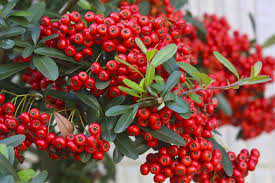

After you arrive into the dinosaurs' period, you are hungry. Luckily, you found red and blue berries.

Photo credit to https://www.whiteflowerfarm.com/viburnum-red-balloon

[You choose to eat the red berries first](death3.md)

Photo credit to [ David Beaulieu](https://www.thespruce.com/do-some-shrubs-bear-poisonous-berries-or-seeds-toxic-leaves-2132696)

[You choose to eat the black berries first](death3.md)

Photo credit to [LINDSEY BARK](https://www.cherokeephoenix.org/Article/index/103352)