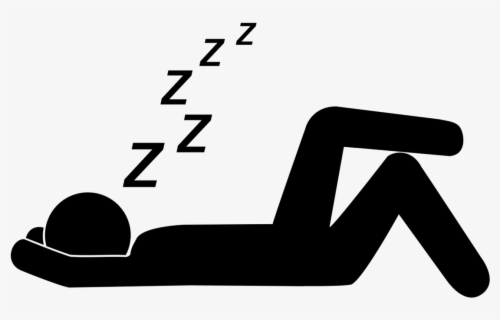

You can't believe that you actually time-travelled. You start panicking.

Photo credit to https://www.centrohealth.com.au/practitioners-at-centro-health/kim-calnan-clinical-psychologist/attachment/funny-vector-cartoon-with-group-of-women-in-panic-and-horror/

[You refuse to accept reality and goes to sleep](death4.md)

Photo credit to https://zenplugs.com/blog/which-ear-plugs-are-best-to-block-the-sound-of-snoring

[You pull out your phone and hope to find help](death5.md)

Photo credit to https://www.google.com/search?safe=strict&q=phone+app+flat+icon&tbm=isch&tbs=simg:CAQSkwEJCTb8Br38PcYahwELEKjU2AQaAAwLELCMpwgaYgpgCAMSKKwU4wi_1Aq0UzxLiCJoKqBSXCpsKuyi_1PsA-3Ta6KOI2tyiUNJA05TYaMJOyPaMP1OtIM3zh5tTGAbHumFrxx7-uYfzgj5c6xJBuUTm5M-Rm9miFqbebiNRa3yAEDAsQjq7-CBoKCggIARIEML9nEQw&sa=X&ved=2ahUKEwii3bL1oLvmAhXjYN8KHVFuAZ4Qwg4oAHoECAQQJg&biw=1366&bih=641#imgrc=1VcLVkC1VsjJfM: